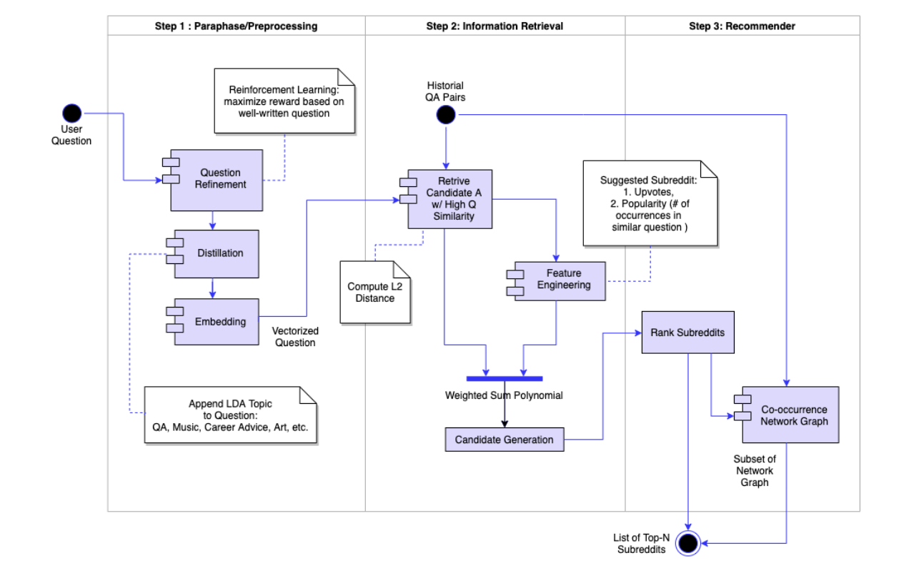
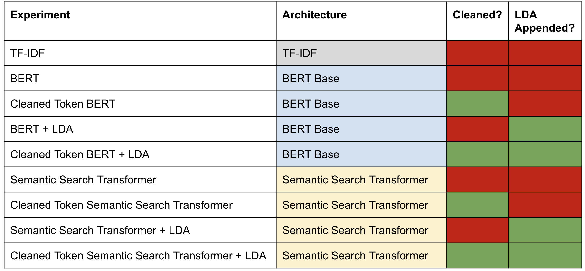
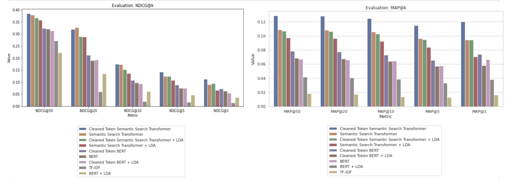
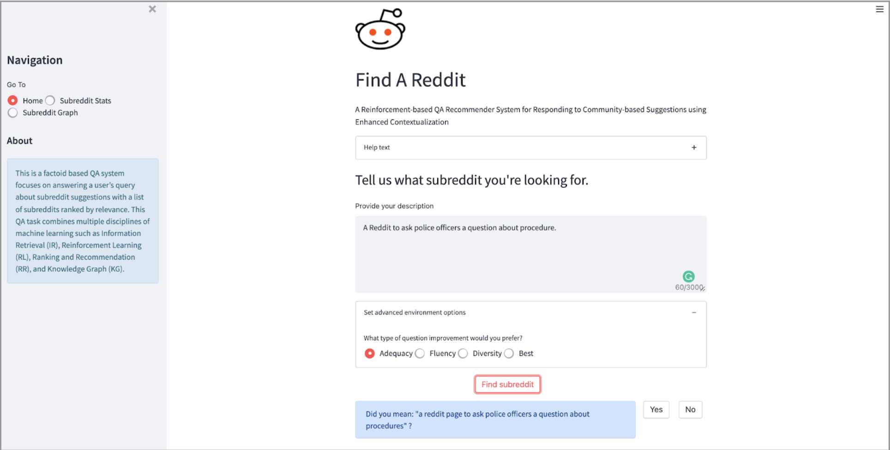

# A Reinforcement-based QA Recommender System for Responding to Community-based Suggestions using Enhanced Contextualization
Team: Abhishek Bais, Haley Feng, Princy Joy, Shannon Phu

December 2021

# Project Summary
In recent years, several Community-based Question Answering (CBQA) platforms spanning multiple verticals such as social news aggregation, business communication, retail, platforms for enthusiast programmers, and social media platforms for interactions and inquiry have gained traction. These platforms provide registered users access to a huge knowledge database of questions and answers accumulated over time. Users can post questions, seek crowdsourced answers, find shared interest groups, and learn from each other.

As CBQA platforms have gained popularity, the volume of questions and answers on them has increased exponentially. For example, in an interview with the Wall Street Journal in December 2020, Reddit, a leading social news aggregation platform, shared that “52 million people visit the site every day”. Previously, Reddit shared that it had over 430 million monthly active users, who made 303.4 million posts in 2020, a 52.4% year-on-year increase. These posts received over 2 billion user comments, up 300 million from 2019. Year on year, CBQA platforms are growing in popularity and user base.

To help registered users find answers, several CBQA platforms organize their content in communities. Reddit organizes its content into topic-based communities called “subreddits”. Users can find relevant communities using tools such as “r/FindAReddit” and join them to post questions and get community help on finding which subreddits to join. However, with over 2,620,000 subreddits and an average of 60,251 new subreddits added to Reddit each month, finding the right community to join is a challenging task.

To address this problem, a Reinforcement-based Question-Answer Recommender System (RQAR) is proposed to help CBQA users find relevant communities for their questions. This system will be used to extract context, group previously answered questions by similarity, learn from user interactions to find, rank, and recommend relevant communities to users.


# Architecture
Our system has three components:
* Data processing
    * Data collection
    * Question refinement
* Information Retrieval
* Recommender
    * Knowledge Graph



## Data Collection and Processing
We collected the training data for our machine learning model to create a question-answer database scraped from Reddit using scraping APIs such as PRAW and Pushshift. We collected 1 year of data between 7/1/2020 - 7/1/2021 for 40 thousand total posts containing questions, answers, and upvote information. We cleaned the data’s text and for parsing issues.

## Reinforcement-based Question Refining
The Paraphrase and Preprocessing Unit collects a user posted question and proposes a paraphrase back to the user using Reinforcement Learning. The Question Refinement module uses a policy and a rewards function aimed at maximizing the reward for the well-formed question. It does so using the Microsoft Azure Personalizer service and Parrot paraphraser utility built on top of the Text to Text Transfer Transformer (T5). These rewards are used by the system to generate refined questions that are provided to the user to seek feedback and improve subsequent queries. If a user likes the rephrased question, the new question will be used to recommend a list of subreddits of interest.

## Information Retrieval
The Information Retrieval Unit consists of a QA database generated from Reddit scraping APIs such as PRAW and Pushshift. A candidate answer retrieval API calculates the semantic similarity between the user’s question and all historical questions using cosine similarity. Historical questions with high semantic similarity are used to query related subreddits and their upvotes. Additional features such as popularity of the subreddits among related questions are created during this process. The semantic similarity and additional features of these subreddits are used to compute a final weighted score. 

## Recommender
The Rank and Recommend Unit ranks the candidate answers generated by the Information Retrieval Unit by total relevance weight to make available high-quality community recommendations to the user as answers. A separate co-occurrence graph API builds a network knowledge graph using all subreddits from the QA database. A subset of the network graph will be displayed along with the recommendation to show the relationship between the final top N subreddits.

# Experiments



## Evaluation Metrics
1. NDCG@k
    * Normalized discounted cumulative gain
    * How close is the predicted ranking of k items to the ideal ranking of k items that a user would prefer
2. MAP@k
    * Mean average precision
    * How many k items did our recommendation system predict which are actually within the labelled dataset

We found that our experiment "Cleaned Token Semantic Search Transformer" performed the best among all our experiments in terms of our metrics, NDCG and MAP.



# Web Application
We deployed our web application on Google Cloud Platform. We utilized Kubernetes engine to deploy a Streamlit Python web application. We integrated a CI/CD pipeline through Github such that each merge into the main branch would trigger a deployment. Each deployment builds inside a Docker container and serves the latest models and code to the hosted web application.



# Deployment steps
## To setup and run webapp locally

0. Set up environment:
```python -m venv ~/.streamlit_ve```
```source ~/.streamlit_ve/bin/activate```

1. Install dependencies:
```cd rqar-webapp```
```pip install -r requirements.txt```

2. Run streamlit app:
```cd app```
```streamlit run app.py```

    (Note: If running into issues of "ModuleNotFoundError", try uninstalling and re-installing package.)

3. Open browser and navigate to page:
```http://localhost:8501/```

#### Docker build 
From root folder: ```docker build --no-cache=true -t rqar_image .```

## Build and Deploy to [Google Kubernetes Engine][gke] cluster

- [Reference1](https://docs.github.com/en/actions/deployment/deploying-to-google-kubernetes-engine)
- [Reference2](https://cloud.google.com/kubernetes-engine/docs/tutorials/gitops-cloud-build)

## Workflow description

For pushes to the `main` branch, this workflow will:

1. Download and configure the Google [Cloud SDK][sdk] with the provided
    credentials.

2. Use a Kubernetes Deployment to push the image to the cluster.

## Setup

1. Create a new Google Cloud Project (or select an existing project) and
    [enable the Container Registry and Kubernetes Engine APIs](https://console.cloud.google.com/flows/enableapi?apiid=containerregistry.googleapis.com,container.googleapis.com).

    ```bash
    gcloud config set project rqar-327218
    gcloud services enable containerregistry.googleapis.com container.googleapis.com
   ```

1. [Create a new GKE cluster][cluster] or select an existing GKE cluster.

   ```bash
    gcloud container clusters create rqar-cluster --num-nodes=1 --region=us-central1-c
    ```

1. [Create a Google Cloud service account][create-sa] if one does not already exist.

    ```bash
    gcloud iam service-accounts create rqarserviceacc
    ```

1. Retrieve the email address of the service account you just created:

   ```bash
    gcloud iam service-accounts list
    ```

1. Add the the following [Cloud IAM roles][roles] to your service account:
    - `Kubernetes Engine Developer` - allows deploying to GKE

    ```bash
        gcloud projects add-iam-policy-binding rqar-327218 \
        --member=serviceAccount:rqarserviceacc@rqar-327218.iam.gserviceaccount.com \
        --role=roles/container.developer \
        --role=roles/container.admin \
        --role=roles/storage.admin \
        --role=roles/container.clusterViewer
   ```

1. Verify the added roles

    ```bash
        gcloud projects get-iam-policy rqar-327218  \
        --flatten="bindings[].members" \
        --format='table(bindings.role)' \
        --filter="bindings.members:rqarserviceacc"
    ```

1. [Create a JSON service account key][create-key] for the service account.

1. Add the following secrets to your repository's secrets:

    - `GKE_PROJECT`: Google Cloud project ID

    - `GKE_SA_KEY`: the content of the service account JSON file

1. Update `.github/workflows/gke.yml` to match the values corresponding to your
    VM:

    - `GKE_CLUSTER` - the instance name of your cluster

    - `GKE_ZONE` - the zone your cluster resides

    You can find the names of your clusters using the command:

    ```bash
    gcloud container clusters list --project $PROJECT_ID
    ```

    and the zone using the command:

    ```bash
    gcloud container clusters describe <CLUSTER_NAME>
    ```

## Run the workflow

1. Add and commit your changes:
2. Push to the `main` branch:
3. View the GitHub Actions Workflow by selecting the `Actions` tab at the top
    of your repository on GitHub.

## Expose the GKE port

```kubectl expose deployment gke-test-service --type=LoadBalancer  --port 80 --target-port 8501```

## Kubernetes commands for setup and debug

1. To get info on deployed pods

    ```kubectl get pods```

    ```kubectl describe services gke-test-service```

2. To get events

    ```kubectl get events```

3. To retrieve logs

    ```kubectl logs gke-test-586ff98fb5-smtg2 -p```

4. To scale deployment

    ```kubectl scale deployment gke-test --replicas=3```

5. To turn down cluster without deleting

    ```kubectl scale deployment gke-test --replicas=0```

[actions]: https://help.github.com/en/categories/automating-your-workflow-with-github-actions
[cluster]: https://cloud.google.com/kubernetes-engine/docs/quickstart#create_cluster
[gke]: https://cloud.google.com/gke
[create-sa]: https://cloud.google.com/iam/docs/creating-managing-service-accounts
[create-key]: https://cloud.google.com/iam/docs/creating-managing-service-account-keys
[sdk]: https://cloud.google.com/sdk
[secrets]: https://help.github.com/en/actions/automating-your-workflow-with-github-actions/creating-and-using-encrypted-secrets
[roles]: https://cloud.google.com/iam/docs/granting-roles-to-service-accounts#granting_access_to_a_service_account_for_a_resource
